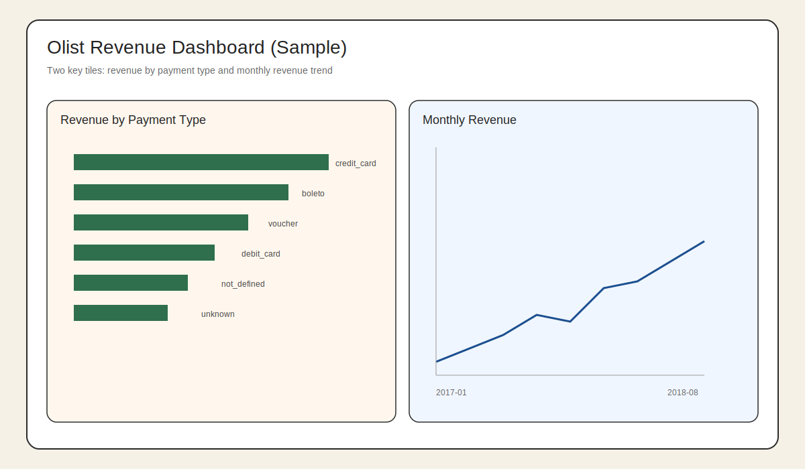
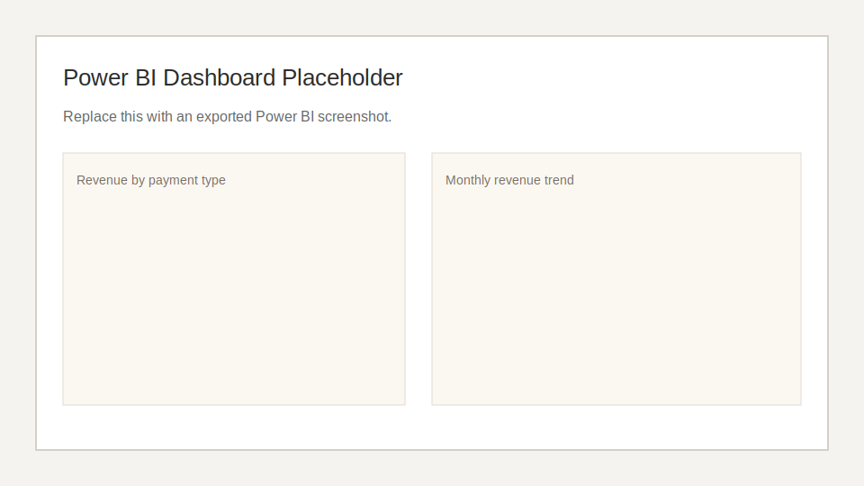

# Kestra Snowflake Olist Pipeline

This project delivers an end-to-end, orchestration-first data pipeline using Kestra to ingest the Olist e-commerce dataset from Kaggle and load it into Snowflake. The primary objective is to demonstrate a production-ready data lifecycle—moving from raw, denormalized landing zones to structured analytical views within a cloud data warehouse. The repository demonstrates production-minded data engineering practices: explicit orchestration, separable staging and transformation layers, containerized execution, and predictable environment management.

## Problem Statement
Build a reproducible data pipeline that enables analysis of order revenue and delivery outcomes in the Olist e-commerce dataset, with a focus on how payment types and delivery timing correlate with revenue over time.

## Success Metrics
- Monthly revenue trend (orders and total payment value over time).
- Revenue distribution by payment type.
- Delivery outcome rate (delivered vs. other statuses) and its impact on revenue.

## What This Pipeline Does
1. Downloads and unzips the Olist dataset via the Kaggle CLI.
2. Uploads all CSVs to Snowflake staging and loads them with the stage-and-copy pattern.
3. Builds curated analytical tables in Snowflake for downstream analysis.
4. Orchestrates the workflow as a single, repeatable pipeline.

## Architecture and Design Highlights
- Orchestration-first design with independent, composable flows.
- Clear separation between ingestion (staging tables) and transformation (analytics tables).
- Explicit Snowflake object creation, file formats, and load commands for repeatability.
- Containerized execution with a custom Kestra image that includes the Kaggle CLI.
- Secret management aligned to Kestra's `secret('...')` resolver.
- Pipeline designed for transparency and easy debugging in the Kestra UI.
- Idempotency-aware design: Snowflake load logic is structured to support schema checks and table truncation/merge strategies so repeated runs can converge on a consistent state.

## Repository Layout
- `flows/olist_download.yml`: Downloads dataset and stores files in Kestra internal storage.
- `flows/olist_lake.yml`: Copies raw CSVs to a local MinIO (S3-compatible) data lake.
- `flows/snowflake_loader.yml`: Creates Snowflake objects and loads all CSVs.
- `flows/snowflake_transform.yml`: Builds analytical tables (`olist_orders_cleaned`, `fact_sales`). This stage implements a modular transformation layer, moving data from Raw (Bronze) staging tables to Analytical (Silver/Gold) fact and dimension tables.
- `flows/olist_pipeline.yml`: Orchestrates download → load → transform.
- `docker-compose.yml`: Runs Kestra and Postgres with local storage mounts.
- `Dockerfile`: Extends `kestra/kestra` with Python and Kaggle CLI.
- `dbt/`: Optional dbt project that mirrors the transformation logic.
- `dbt_duckdb/`: Parallel dbt project for Power BI using DuckDB + local CSVs.
- `secrets.conf`: Source-of-truth credentials (plain text, local only).
- `.env`: Runtime configuration consumed by Docker/Kestra (plain text, local only).
- `infra/terraform/`: Optional Terraform skeleton to provision a cloud data lake bucket.

## Environment and Secret Management
This project follows Kestra's open-source secret handling: secrets are provided as base64-encoded environment variables prefixed with `SECRET_`, and referenced in flows with `{{ secret('...') }}`. Do not put raw secrets directly in `.env` — only the encoded `SECRET_*` values should live in `.env_encoded`.

Files:
- `secrets.conf`: plain-text source of truth for sensitive values (local only).
- `.env_encoded`: auto-generated base64 secrets file for Kestra (local only).
- `.env`: non-secret runtime configuration for Docker services (local only).

Steps:
1. Put all secrets used by flows in `secrets.conf` (Snowflake, Kaggle, MinIO).
2. Generate `.env_encoded`:
   - `bin/encode_secrets.sh secrets.conf .env_encoded`
3. Keep non-secret infra settings in `.env` (Postgres, Kestra basic auth, MinIO root creds). `SECRET_*` values should only be in `.env_encoded`.

Kestra reads `.env_encoded` and resolves secrets via `{{ secret('KEY') }}` without the `SECRET_` prefix.

## Local Data Lake (MinIO)
This project includes a local, S3-compatible data lake using MinIO. Raw CSVs are copied to the bucket as an additional landing zone before loading into Snowflake.

Required environment variables (plain text in `.env` and mirrored as `SECRET_` for Kestra):
- `MINIO_ROOT_USER`, `MINIO_ROOT_PASSWORD`
- `MINIO_BUCKET` (e.g., `olist-lake`)
- `MINIO_ACCESS_KEY`, `MINIO_SECRET_KEY` (can match root user/pass)
- `MINIO_REGION` (e.g., `us-east-1`)
- `MINIO_ENDPOINT` (e.g., `http://minio:9000`)

Access MinIO console at `http://localhost:9001`.

## Optional dbt Transformations
An optional dbt project lives in `dbt/`. The pipeline runs dbt by default (`use_dbt=true`) and uses the mounted project at `/app/dbt` with the same Snowflake secrets via environment variables.

To disable dbt and run the in-warehouse SQL transforms instead, set `use_dbt=false` when executing the flow.

## Optional Data Lake Copy
The MinIO data lake copy step is optional and disabled by default to keep pipeline runs reliable.
Enable it by setting `use_lake=true` when running the `olist_pipeline` flow.

## Quickstart
1. Create `secrets.conf` with your Snowflake and Kaggle credentials.
2. Generate `.env_encoded`:
   - `bin/encode_secrets.sh secrets.conf .env_encoded`
3. Populate `.env` with non-secret values only:
   - `POSTGRES_*` and `KESTRA_BASIC_AUTH_*` values (plain text)
   - MinIO non-secret settings (see "Local Data Lake")
4. Build and start the stack: `make up`
5. Open the Kestra UI at `http://localhost:8080`.
6. Import flows (one time or after changes): `bin/import_flows.sh`
7. Run the `olist_pipeline` flow (dbt is enabled by default).

## Validation
Run these in Snowflake to confirm successful loads and transformations:

```sql
USE ROLE KESTRAINGESTION;
USE WAREHOUSE COMPUTE_WH;
USE DATABASE KESTRA_DB;
USE SCHEMA PUBLIC;

SELECT COUNT(*) FROM olist_orders;
SELECT COUNT(*) FROM olist_customers;
SELECT COUNT(*) FROM fact_sales;
```

## Warehouse Optimization
`fact_sales` is clustered by `purchase_at` to improve time-series queries such as monthly revenue trends. This supports the dashboard and reporting use cases focused on temporal analysis.

## Dashboard
Two options are provided:
- Streamlit dashboard in `dashboard/streamlit_app.py`
- Power BI guide in `dashboard/powerbi/README.md` (uses dbt model `powerbi_dataset`)

Both cover:
- Revenue by payment type (categorical distribution)
- Monthly revenue trend (time series)

Power BI can use Snowflake (dbt) or DuckDB (local) as the data source; see `dashboard/powerbi/README.md`.

Sample screenshots:



Run the Streamlit dashboard locally:
```bash
pip install -r dashboard/requirements.txt
streamlit run dashboard/streamlit_app.py
```

## Notes
- The Kaggle CLI is installed in the Kestra container via the `Dockerfile`.
- Kestra secrets are provided through environment variables prefixed with `SECRET_`.
- The pipeline is fully operational and can be extended with additional models and quality checks.
